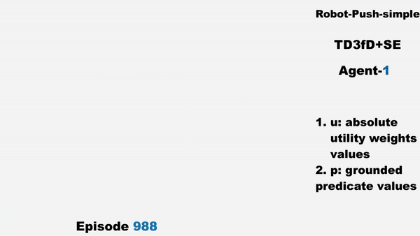
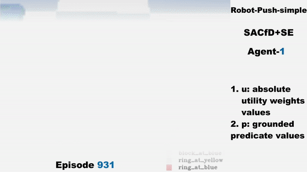
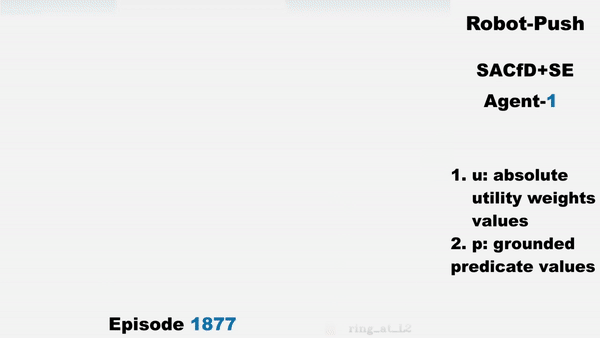
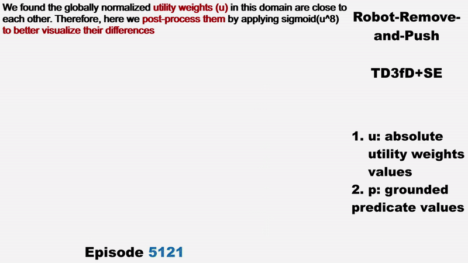
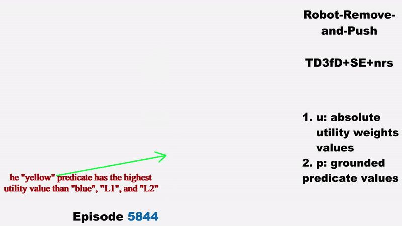
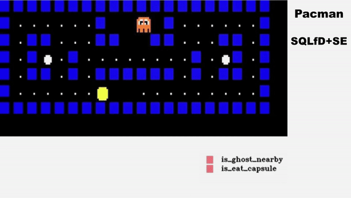

# Welcome to SERLfD: Empowering Robots with Self-Explanation

Are you prepared for the next groundbreaking leap in robotics? Picture robots not just executing tasks but autonomously comprehending their decisions. Welcome to the realm of SERLfD – Self-Explanation for Reinforcement Learning from Demonstrations.

SERLfD serves as the bridge between machines and humans, endowing robots with introspective capabilities grounded in human concepts. In simpler terms, it enables robots not only to learn tasks from human demonstrations but also to identify crucial concepts within these demonstrations, determining success or failure, thus fostering transparency and understanding.

At its core, SERLfD relies on the concept of self-explanation, empowering robots to independently grasp their actions and decisions. Much like humans reflecting on their choices, learning from mistakes, and evolving, SERLfD enables robots to follow a similar path.

Envision a scenario where a robot assistant assists you in the kitchen. With SERLfD, the robot transcends mere mimicry of demonstrations; it learns from human examples through the lens of human concepts, facilitating a deeper understanding and collaboration. As the robot observes and interacts with its environment, it develops self-explanations to enhance its comprehension of its actions.

During a cooking task, for instance, the robot might internally reason, "I'm choosing olive oil over butter because it contains fewer calories and is better for health." This self-explanation process empowers the robot to introspect on its decisions, analyze past successes and failures, gain insights, and continuously refine its performance through practice and exposure to new experiences. By scrutinizing both successful and unsuccessful attempts, the robot becomes more adept at cooking and better equipped to assist you in the kitchen.

SERLfD seamlessly integrates the strengths of Reinforcement Learning from Demonstrations (RLfD) and imitation learning, offering a comprehensive approach to robot learning that enhances autonomy, understanding, and adaptability.

## Technical Details

### Self-Explanation Mechanism

- **Objective:** SERLfD supports RLfD by simultaneously learning to identify task-relevant domain predicates for each task step.
- **Implementation:** The self-explanation mechanism involves training a Self-Explanation Network (SE-Net) to predict predicate utility weights (\textbf{\textit{u}}) that quantify the relevance of domain predicates at a given state.

### Learning Components

- **Dual-Task Learning:** SERLfD interleaves the learning of two sub-tasks:
  1. **RL Agent (Generator):** Trained to maximize cumulative environment rewards guided by self-explanations.
  2. **Self-Explainer (Discriminator):** Trained to distinguish between successful and unsuccessful experiences.

### Architecture


- **Components:**
  - **SE-Nets:** Self-Explanation Networks map states to sets of utility weights (\textbf{\textit{u}}) corresponding to grounded predicate values.
  - **RL Agent (Generator):** Trained to maximize cumulative environment rewards, incorporating self-explanations.
  - **Discriminator:** Includes the SE-Net, distinguishes between successful and unsuccessful trajectories.

### Predicate Grounding

- **Assumption:** Robotics experts provide task-agnostic domain knowledge as human-understandable predicates.
- **Representation:** Predicates are logical expressions describing relationships among objects, with arguments referred to as grounded predicate values.
- **Binary Predicate Variables:** Represented as $P=\langle p_1, p_2, ..., p_N \rangle$, corresponding to a domain $D$ supporting various tasks.

### Self-Explanation Process

- **SE-Net Output:** Generates predicate utility weights (**_u_**) representing the utility of each predicate in elucidating decision viability.
- **Integration:** These utility weights are integrated into the RL state or used for reward shaping.

### RL Agent Learning

- **State Augmentation:** The RL state is augmented with predicate values, providing more detailed guidance for RL agents.
- **Reward Augmentation:** Shaped rewards are computed by utilizing self-explanations, aiding faster learning of tasks by RL agents.

### Discriminator Training (SE-Net)

- **Objective:** Discriminator is trained to distinguish between successful and unsuccessful trajectories, aiding the SE-Net in learning relevant self-explanations.
- **Loss Function ($L_{SE}$):** Utilizes a binary logistic regression loss to train the SE-Net by distinguishing between success and failure experiences.

In essence, SERLfD integrates RLfD with self-explanation learning, enhancing robot autonomy and adaptability. The SE-Net plays a crucial role in providing nuanced guidance, and the dual-task learning approach ensures a holistic improvement in both the RL agent's policy and the self-explanation mechanism. The framework is designed to facilitate efficient learning from human demonstrations and the extraction of meaningful insights to drive autonomous decision-making in robots.

## Visualizing Self-Explanations
<p align="center">
    
</p>
<p align="center">
    
    
</p>
<p align="center">
    
    
</p>
<p align="center">
    
    
</p>
<p align="center">
    
</p>

## Learning Curves

<p align="center">
    
</p>

<div class="col-sm-6 col-xs-6">
  <p><font size="+1"> Self-Explanation Guided Robot Learning</font></p>
  <br />
  <iframe width="560" height="315" src="https://www.youtube.com/embed/w5nGYOdVMiA" frameborder="0" gesture="media" allow="encrypted-media" allowfullscreen></iframe>
  </iframe>
</div>

## Installation

- `git clone https://github.com/YantianZha/SERLfD.git`

- Download the demonstrations from [here](https://drive.google.com/drive/folders/18_PAerU15nanE3PMuu-eInZCKIosEN4F?usp=share_link).

- The code has been tested on 
  - Operating System: Ubuntu 18.04, CentOS 7
  - Python Version: 3.7, 3.8
  - gym version <= 0.25.2
  - numpy version == 1.20.1
  - GPU: RTX 1080, RTX 3080

#### Prerequisites

- In the project folder, create a virtual environment in Anaconda:

  ```
  conda env create -f SERLfD.yml
  conda activate SERLfD
  ```

- SERLfD

  ```
  cd SERLfD
  ```


## Training

#### TD3fD+SE and SACfD+SE (Our Method)

For example, running the following commands allows to train TD3fD and SACfD augmented with using self-explanations.


#### Baseline Algorithms

For example, running the following commands allows to train baseline RLfD agents,

```
CUDA_VISIBLE_DEVICES=1 nohup python3 run_fetch_push_v0p.py --algo sacfd --episode-num 3000 --off-render --max-episode-steps 50 --demo-path /data/Yantian/datasets/SERL/Fetch/Push-v0 --log > /data/Yantian/nohup_sacfd.out &
```

#### RLfD+SE Algorithms
```
CUDA_VISIBLE_DEVICES=1 nohup python3 run_fetch_push_v0p.py --algo sesacfd_v2_s --episode-num 3000 --off-render --max-episode-steps 50 --demo-path /data/Yantian/datasets/SERL/Fetch/Push-v0 --log > /data/Yantian/nohup_sesacfd_v2_s.out &
```


        
## Citation

If you find our paper or code is useful, please consider citing:
```kvk
@article{yantian-self-expl,
  title={Learning from Ambiguous Demonstrations with Self-Explanation Guided Reinforcement Learning},
  author={Zha, Yantian and Guan, Lin and Kambhampati, Subbarao},
  journal={AAAI24 Main Track and AAAI-22 Workshop on Reinforcement Learning in Games},
  year={2021}
}
```
