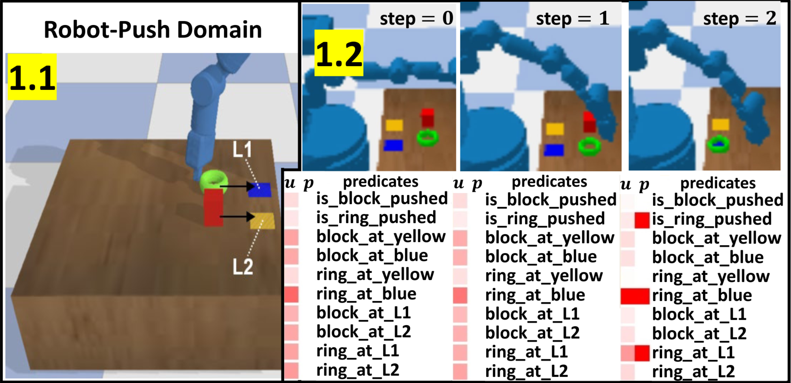
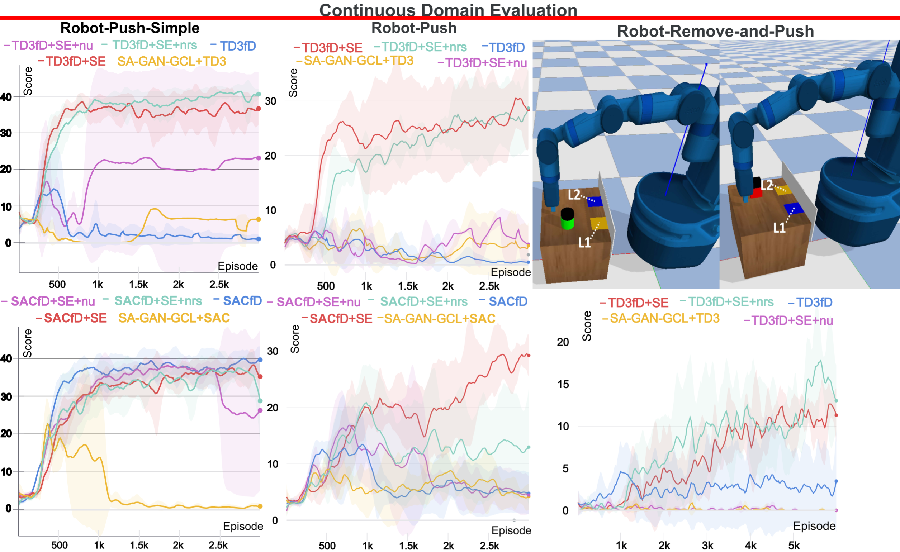

# SERLfD (Self-Explanation-guided Reinforcement Learning from Demonstrations)

This repository contains the implementation for the paper [Learning from Ambiguous Demonstrations with Self-Explanation Guided Reinforcement Learning](https://arxiv.org/pdf/2110.05286.pdf).


In this paper, we present an algorithm that iteratively learning to self-explain potentially ambiguous demonstrations thorough a shared vocabulary with humans, and a policy to accomplish tasks specified by demonstrations. We provide a comprehensive evaluation over three continuous robot control domains and one discrete Pacman domain. 

<p align="center">
    
</p>

## Installation

- `git clone https://github.com/YantianZha/SERLfD.git`

- The code has been tested on 
  - Operating System: Ubuntu 18.04, CentOS 7
  - Python Version: 3.7, 3.8
  - GPU: RTX 1080, RTX 3080

#### Prerequisites

- In the project folder, create a virtual environment in Anaconda:

  ```
  conda env create -f SERLfD.yml
  conda activate SERLfD
  ```

- SERLfD

  ```
  cd SERLfD
  pip install -e .
  ```


## Training

#### TD3fD+SE and SACfD+SE (Our Method)

For example, running the following commands allows to train TD3fD and SACfD augmented with using self-explanations.


#### Baseline Algorithms

For example, running the following commands allows to train baseline RLfD agents,

```
python 
```

## Results

<p align="center">
    
</p>

<div class="col-sm-6 col-xs-6">
  <p><font size="+1"> Self-Explanation Guided Robot Learning</font></p>
  <br />
  <iframe width="560" height="315" src="https://www.youtube.com/embed/w5nGYOdVMiA" frameborder="0" gesture="media" allow="encrypted-media" allowfullscreen></iframe>
  </iframe>
</div>
        
## Citation

If you find our paper or code is useful, please consider citing:
```kvk
@article{yantian-self-expl,
  title={Learning from Ambiguous Demonstrations with Self-Explanation Guided Reinforcement Learning},
  author={Zha, Yantian and Guan, Lin and Kambhampati, Subbarao},
  journal={AAAI-22 Workshop on Reinforcement Learning in Games and arXiv preprint arXiv:2110.05286},
  year={2021}
}
```
